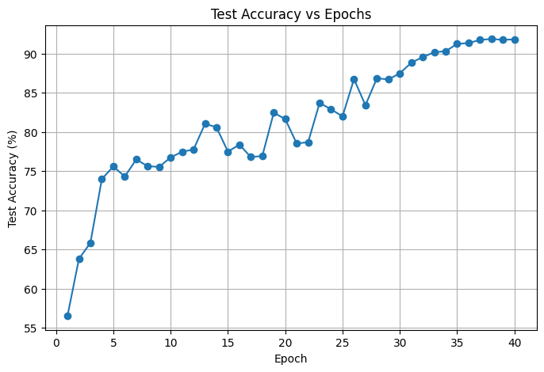
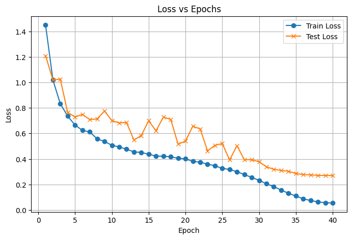

# 🧠 Custom Deep CNN for CIFAR-10 (PyTorch)

This project implements a convolutional neural network designed **from scratch** using PyTorch to classify the CIFAR-10 dataset. Unlike pretrained models like ResNet, this architecture was built manually with **residual-style skip connections**, **batch normalization**, and **dropout**, demonstrating how effective deep learning models can be designed without using existing architectures.

---

## 🚀 Highlights

- ✅ Custom CNN model (not based on ResNet or VGG)
- 🔁 Residual-style skip connections using 1×1 convolutions
- 🧼 Batch normalization and dropout for regularization
- 🎛️ Trained with `OneCycleLR` learning rate scheduling
- 📈 Achieved **91.81% test accuracy** on CIFAR-10 (from scratch)

---

## 📊 Results

| Metric         | Value         |
|----------------|---------------|
| Train Accuracy | 98.18%        |
| Test Accuracy  | **91.81%**    |
| Model Params   | ~X million    |
| Architecture   | Custom deep CNN with skip connections |

---

### 📉 Accuracy and Loss Curves



_Test accuracy steadily increases, reaching saturation at ~91%_



_Train and test loss indicate strong generalization with minimal overfitting_

---

## 🧪 Dataset

- CIFAR-10: 60,000 32×32 color images in 10 classes
- Split: 50,000 train / 10,000 test
- Downloaded automatically with `torchvision.datasets.CIFAR10`

---

## 📁 Files in This Repository

| File | Description |
|------|-------------|
| `CIFAR10_CustomCNN.ipynb` | Full training pipeline and model |
| `plots/` | Training and evaluation plots |
| `requirements.txt` | Python dependencies (PyTorch, torchvision, etc.) |
| `README.md` | Project documentation |

---

## 🔧 How to Run

### ⚙️ Option 1: Local Python Environment

```bash
# 1. Clone the repository
git clone https://github.com/yourusername/custom-cnn-cifar10.git
cd custom-cnn-cifar10

# 2. (Optional) Create and activate virtual environment
python -m venv env
source env/bin/activate  # On Windows: env\Scripts\activate

# 3. Install dependencies
pip install -r requirements.txt

# 4. Launch notebook
jupyter notebook CIFAR10_CustomCNN.ipynb
